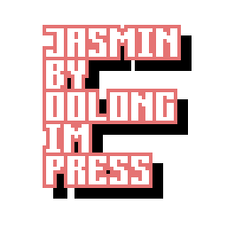

# JASMIN

## INTRO
Jasmin
Jasmin是基于SDL3的, OolongImPress自用的GUI.

关于此文档可能任然有模糊之处, 可以直接联系我:)

## 功能 FUNCTION

* debug能力
* menu二维菜单的交互
* 3d模型的渲染

## 代码风格 CODING-STYLE

### 约束对象

* 标识符
* 签名
* 环境

### 函数标识符

举例某函数要初始化(init)某结构体(sth).

* 如果该函数没有明确的环境所属, 或者极其泛用, 则用驼峰命名法, 即`init + sth = initSth`, 第一个单词(通常为动词)小写, 以后单词首字母大写.
* 如果该函数有明确的环境所属, 设环境名为Env, 则以此格式命名: `ENV_InitSth`, 环境名(Env)全大写(ENV), 再加下划线(ENV_), 加首字母大写的单词.

一个函数可以被当作一个动作, 所以最好用一个动词取名, 并且该动词尽可能向前放.

### 特别函数标识符

以下为特别函数标识符及其解释:

| 返回类型  | 函数名             | 传入参数       |
| --------- | ------------------ | -------------- |
| MyStruct* | XX_CreateMyStruct  | ...            |
| void      | XX_DestroyMyStruct | MyStruct*      |

* init & deinit: 初始化(deinit前只调用一次)和反初始化(在unload后可反复调用), 通常不会有什么文件参数要求.
* load & unload: 载入(init后unload前只调用一次)和释放(可反复调用), 通常参数和文件有关.
* renew: 刷新(load后unload前可反复调用), 刷新数据.
* draw: 绘制(load后unload前可反复调用), 绘制数据, 不能涉及任何非临时动态内存分配.

### 参数检查

所谓参数不仅仅是狭义的「传入参数」, 一个函数依赖的所有外部变量/常量都可以叫做参数.

条件检查类型分别为:

* 先决条件, Pre Condition: 调用函数的条件, 条件判断被写到了函数内部, 「不满足先决条件」不被视作「错误」.
* 必要条件, Req Condition: 调用函数的条件, 「不满足先决条件」被视作「错误」, 输出错误.
* 可选条件, Opt Condition: 函数的细节条件, 「不满足先决条件」不被视作「错误」, 而且会由默认值填充.

输出错误有两种方式:

* printf: 最泛用的输出方式.
* DEBUG_SendMessageR: 如果报错是在循环中发生的, 也就是说「在每一次循环中都会发生这样的错误」, 则通过DEBUG_SendMessageR输出到窗口.

### 环境依赖

大部分README.md都会以一个环境依赖图开头.

图中的点线代表:

* 点: 环境.
* 线(有向, 无名): 被依赖. (例如A -> B为“A被B依赖”或“B依赖A”.)
* 线(有向, *.c): 谁的源文件在你实现. (例如a.h -- a.c -> b.h为“a.h对应的a.c在b.h处实现”.)
