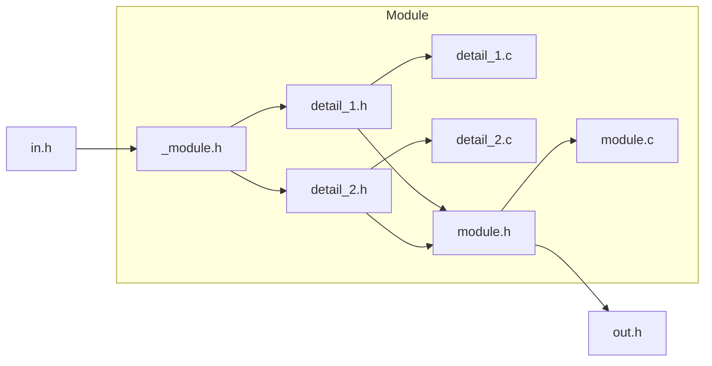
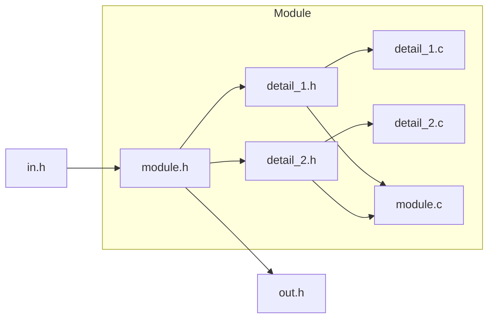

# Jasmin by OolongImPress


## INTRO

Jasmin is a 2D&3D rendering library based on C and SDL3, currently for internal use by OolongImPress.

> ATTENTION: This doc is still under construction!

## INSTALL & UPGRADE

### macOS

```bash
brew uninstall sdl3 sdl3_ttf sdl3_image
```

```bash
brew install sdl3 sdl3_ttf sdl3_image
```

```bash
brew upgrade sdl3 sdl3_ttf sdl3_image
```

## MODULE

We divide the modules into 2 kinds: OpenModule & ClosedModule.

* OM: The all paras, funcs, structs, enums, unions, macro in this module are callable.
* CM: The most paras, funcs, structs, enums, unions, macro in this module are uncallable, except those declared in head file.

### OM-Example

### CM-Example


