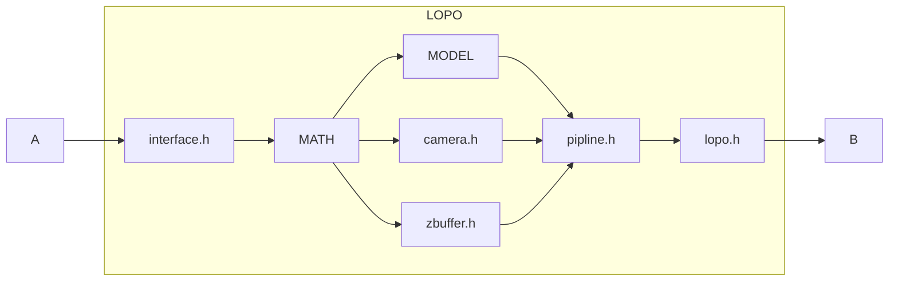
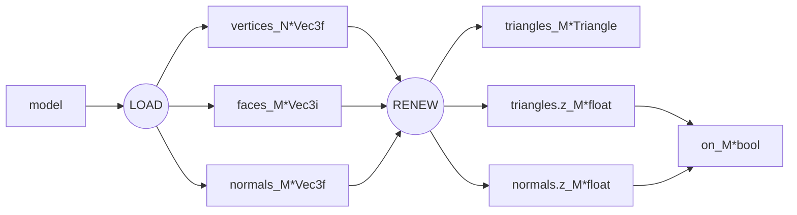
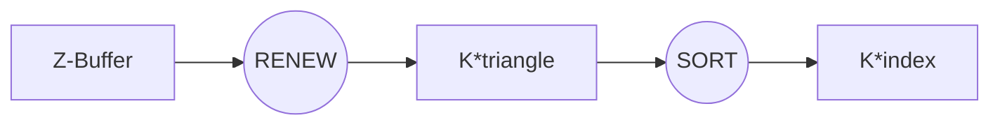

# Lo-Po

trans: mesh -> model -> world -> view -> proj

$$
\begin{aligned}
& bone, pose, camera\in\mathbb{R}^6\\
& mesh\in\mathbb{R}_{n\times4}\\
& M, W, V:\mathbb{R}^7\to\mathbb{R}_{4\times4}\\
& [mesh\times M(bone)]\times[W(pose)\times V(camera)]
\end{aligned}
$$

$$
\left[\begin{matrix}
x,y,z,1
\end{matrix}\right]
\times
\left[\begin{matrix}
0 & 0 & -1 & 0 \\
1 & 0 & 0 & 0 \\
0 & -1 & 0 & 0 \\
\frac{W}{2} & \frac{H}{2} & 0 & 1 \\
\end{matrix}\right]
=
\left[\begin{matrix}
\frac{W}{2} +y,\frac{H}{2} -z,-x,1
\end{matrix}\right]
$$

理论上, 把计算的顶点放在「齐次坐标系」里可以让矩阵表达式看起来更加简介, 程序上不这么做的理由也有:

* Nx4的顶点数据w分量都为1, 明显冗余.
* 乘法的开销比加法大

因此有以下表达式, 左为Vec4计算, 右为Vec3计算.

$$
\left[\begin{matrix}
V_{1\times3} & I_{1\times1}
\end{matrix}\right]
\times
\left[\begin{matrix}
R_{3\times3} & O_{3\times1}\\
T_{1\times3} & I_{1\times1}
\end{matrix}\right]
=
\left[\begin{matrix}
V_{1\times3}R_{3\times3} + T_{1\times3} & I_{1\times1}\\
\end{matrix}\right]
$$

## Z-Buffer

Model只储存INIT&LOAD相关的数据, 经过RENEW得到的实时数据会传递给zBuffer.

Z-Buffer排序的是「投影在屏幕上的三角形float[6]」依据的是「对应的Z深度float[1]」

### Model的数据如何流向Z-Buffer?

### Z-Buffer如何处理数据?

