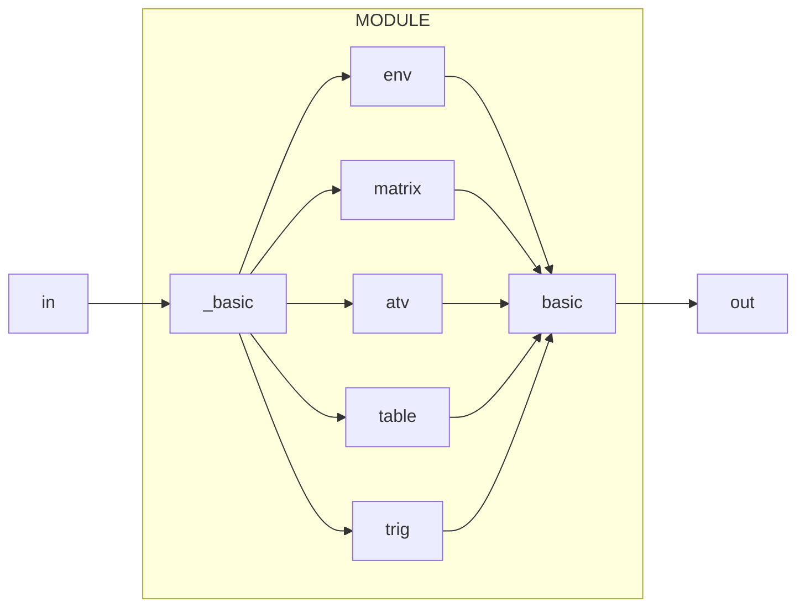

# Basic

```mermaid
graph LR
    subgraph MODULE
        _basic --> env --> basic
        _basic --> matrix --> basic
        _basic --> atv --> basic
        _basic --> table --> basic
        _basic --> trig --> basic
    end
    in --> _basic
    basic --> out
```
