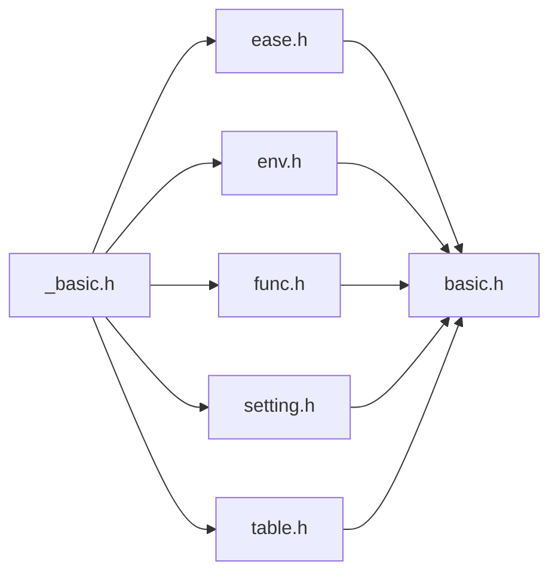

# Basic

```mermaid
graph LR
    _basic.h --> ease.h --> basic.h
    _basic.h --> env.h --> basic.h
    _basic.h --> func.h --> basic.h
    _basic.h --> setting.h --> basic.h
    _basic.h --> table.h --> basic.h
```
