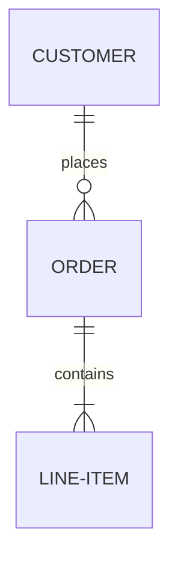

# Jasmin

## 简介 Intro

Jasmin是基于SDL3的, OolongImPress自用的GUI.

## 功能 Function

* debug能力
* menu二维菜单的交互
* 3d模型的渲染

## 依赖 Dependency

### 串联依赖 Series-Dependency

$$
\left[\begin{matrix}\text{SDL3}\\ \text{toml}\end{matrix}\right]
\to 
\text{setting}
\to 
\text{ease}
\to
\text{debug} 
\to 
\text{device} 
\to 
\text{basic}
$$

### 并联依赖 Parallel-Dependency

$$
\text{basic} 
\to
\left[\begin{matrix}
  \text{menu} \\
  \text{lo\_tri}
\end{matrix}\right]
\to 
\text{jasmin}
$$

你好
