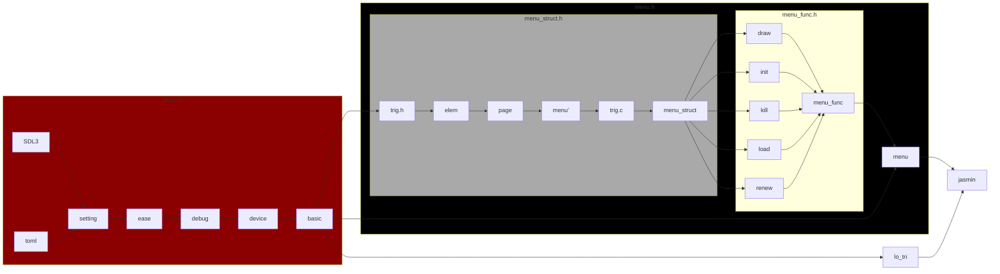

# Jasmin

## 简介 Intro

Jasmin是基于SDL3的, OolongImPress自用的GUI.

## 功能 Function

* debug能力
* menu二维菜单的交互
* 3d模型的渲染

## 依赖 Dependency

```mermaid
graph LR
    subgraph basic.h
        SDL3 --> setting
        toml --> setting --> ease --> debug --> device --> basic
    end
    style basic.h fill: darkred
    subgraph menu.h
        subgraph menu_struct.h
            basic --> trig.h --> elem --> page --> menu' --> trig.c --> menu_struct
        end
        style menu_struct.h fill: darkgray
        subgraph menu_func.h
            menu_struct --> draw --> menu_func
            menu_struct --> init --> menu_func
            menu_struct --> kill --> menu_func
            menu_struct --> load --> menu_func
            menu_struct --> renew --> menu_func
        end
        menu_func --> menu
    end
    style menu.h fill: black
    basic --> menu --> jasmin
    basic --> lo_tri --> jasmin
```
