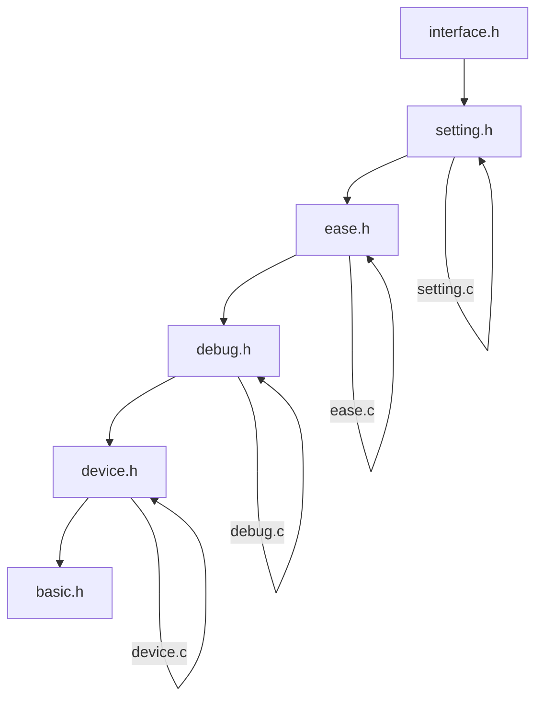

# Basic

```mermaid
graph
    interface.h --> setting.h --> ease.h --> debug.h --> device.h --> basic.h
    setting.h --setting.c--> setting.h
    ease.h --ease.c--> ease.h
    debug.h --debug.c--> debug.h
    device.h --device.c--> device.h
```
