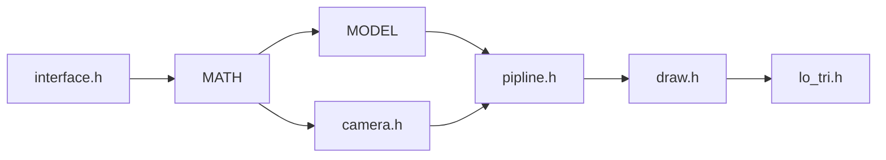
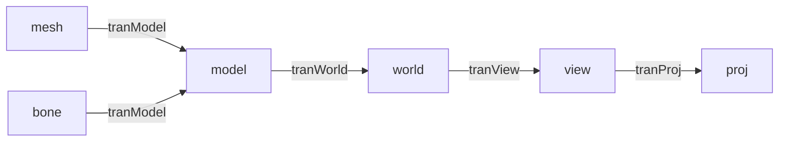

# Lo_Tri

```mermaid
graph LR
    interface.h --> MATH
    MATH --> MODEL --> pipline.h
    MATH -->camera.h --> pipline.h
    pipline.h --> draw.h --> lo_tri.h
```

trans: mesj -> model -> world -> view -> proj

```mermaid
graph LR
    mesh --tranModel--> model
    bone --tranModel--> model --tranWorld--> world --tranView--> view --tranProj--> proj

```

$$
M, W, V\in\mathbb{R}_{4\times4}\\
[\text{vec4f}_n]_{N\times 4}
\times (MWV)_{4\times 4}
$$
