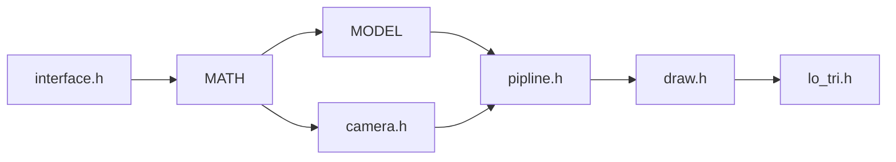

# Lo_Tri

trans: mesh ---> model -> world -> view -> proj

$$
\begin{aligned}
& bone, pose, camera\in\mathbb{R}^7\\
& mesh\in\mathbb{R}_{n\times4}\\
& M, W, V:\mathbb{R}^7\to\mathbb{R}_{4\times4}\\
& [mesh\times M(bone)]\times[W(pose)\times V(camera)]
\end{aligned}
$$

$$
\left[\begin{matrix}
x,y,z,1
\end{matrix}\right]
\times
\left[\begin{matrix}
0 & 0 & -1 & 0 \\
1 & 0 & 0 & 0 \\
0 & -1 & 0 & 0 \\
\frac{W}{2} & \frac{H}{2} & 0 & 1 \\
\end{matrix}\right]
=
\left[\begin{matrix}
\frac{W}{2} +y,\frac{H}{2} -z,-x,1
\end{matrix}\right]
$$

$$
\left[\begin{matrix}
V_{1\times3} & I_{1\times1}
\end{matrix}\right]
\times
\left[\begin{matrix}
R_{3\times3} & O_{3\times1}\\
T_{1\times3} & I_{1\times1}
\end{matrix}\right]
=
\left[\begin{matrix}
V_{1\times3}R_{3\times3} + T_{1\times3} & I_{1\times1}\\
\end{matrix}\right]
$$
