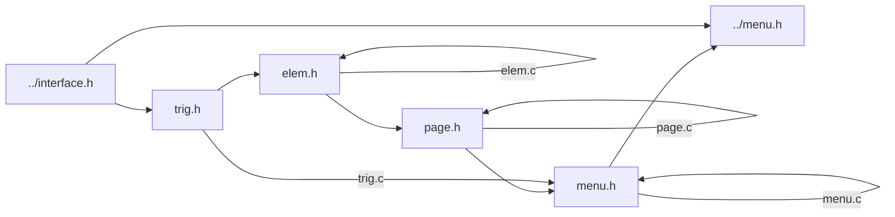
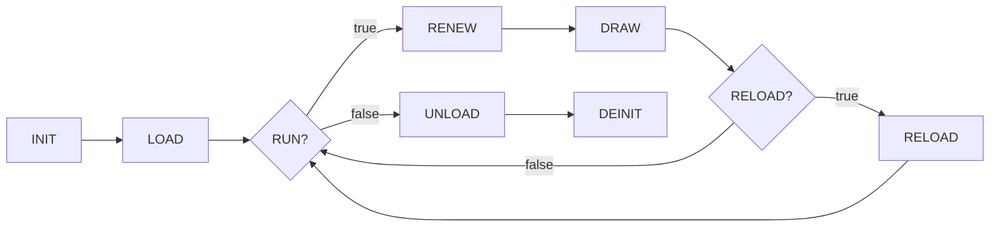

# Menu

> trig.c依赖menu.h的部分函数, 这部分函数不属于../menu.h所暴露的函数, 所以不能指向../menu.h.

## 介绍

Menu为Jasmin的子模块, 承担Mouse和屏幕交互的主要功能.

## 功能

* 静态图片/文本展示
* 可选, 频繁从toml文件重新渲染
* 按钮事件
* 界面跳转

## 设计

非频繁重载: init -> load -> renew -> draw -> unload -> deinit

频繁重载:
