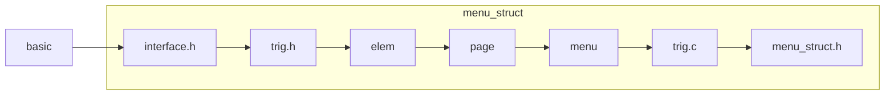

# Menu

## Intro

为Jasmin的子模块

## 功能

* 静态图片/文本展示
* 可选, 频繁从toml文件重新渲染
* 按钮事件
* 界面跳转

非频繁重载: $init \rightarrow load \rightarrow (renew \rightarrow draw)_n \rightarrow kill$.

频繁重载: $init \rightarrow load \rightarrow (renew \rightarrow draw\rightarrow kill \rightarrow load)_n \rightarrow kill$.

## 结构

