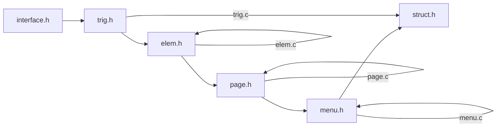

# Struct

## 设计

Elem, Page, Menu都是结构体, 但是Menu只有一个menu实例.

可以将Menu理解为一本书, Page是书里的一页, Elem是书上的句子, 也就是说Menu是一个以menu为根的tree.

因为只有一个menu, 所以只有一个tree.

## menu -> page

page会被menu分配pageId, 然后储存在menu.pages[pageId]里.

menu.pages是一个`MENU_PAGE_VOLUME`大小的数组.

pageId的取值范围是0<=pageId<=MENU_PAGE_VOLUME.

pageRoot的pageId为0, pageEdge的pageId为MENU_PAGE_VOLUME, pageRoot和pageEdge都不储存在menu.pages里, 而是直接作为Menu结构体的成员.

## menu.path -> pageNow

menu.path是一个`MENU_PAGE_VOLUME`大小的数组.

如果menu.path以0开头, 则pageNow=pageRoot.

如果menu.path没有0成员, 则pageNow=pageEdge.

否则直到遇到0, pageNow=menu.pages[menu.path[i]].
