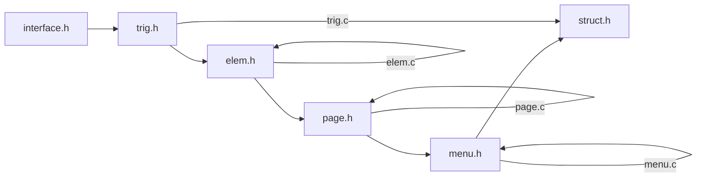

# Struct

```mermaid
graph LR
    interface.h --> trig.h --> elem.h --> page.h --> menu.h --> struct.h
    trig.h --trig.c--> struct.h
    elem.h --elem.c--> elem.h
    page.h --page.c--> page.h
    menu.h --menu.c--> menu.h
```