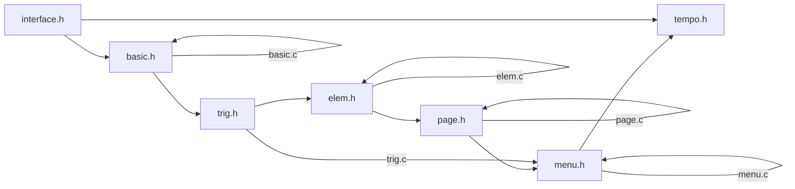

# Tempo

## 介绍

Menu为Jasmin的子模块, 承担Mouse和屏幕交互的主要功能.

## 功能

* 静态图片/文本展示
* 可选, 频繁从toml文件重新渲染
* 按钮事件
* 界面跳转

## Ok

ok意味着可以renew和draw

renew和draw需要检查对象的ok和依赖的ok

例如RenewElem的ok依赖于elem.ok和basic.ok, RenewPage的ok依赖于page.ok, elem.ok, basic.ok.
