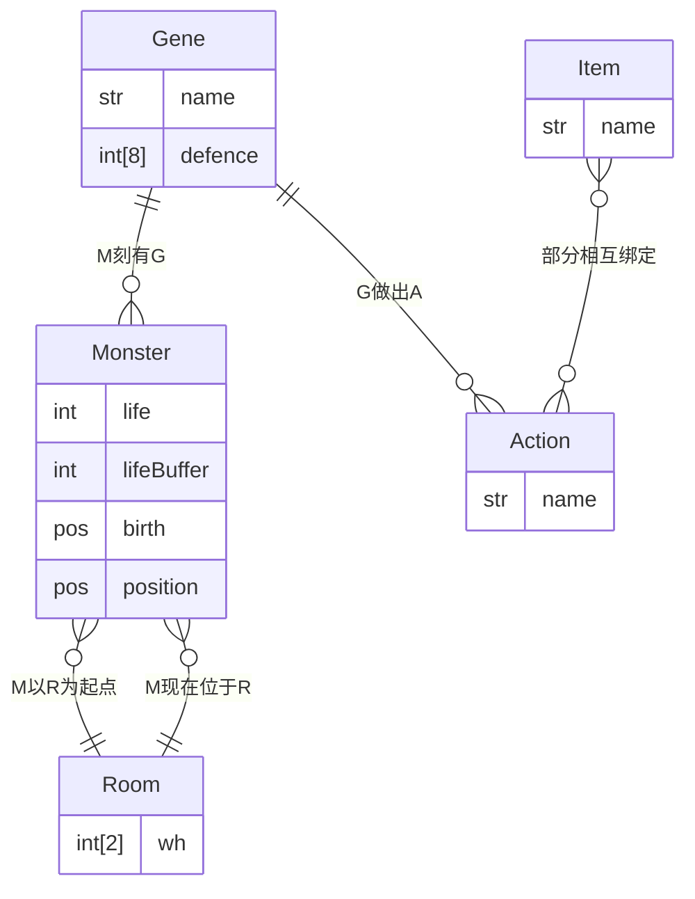

# Maze

```mermaid
erDiagram 
    Gene {
        str name 
        int[8] defence
    }
    Room {
        int[2] wh
    }
    Monster {
        int life
        int lifeBuffer
        pos birth
        pos position
    }
    Action {
        str name
    }
    Item {
        str name
    }
    Gene ||--o{ Monster: "M刻有G"
    Monster }o--|| Room: "M以R为起点"
    Monster }o--|| Room: "M现在位于R"
    Gene ||--o{ Action: "G做出A"
    Item }o--o{ Action: "部分相互绑定"
```
