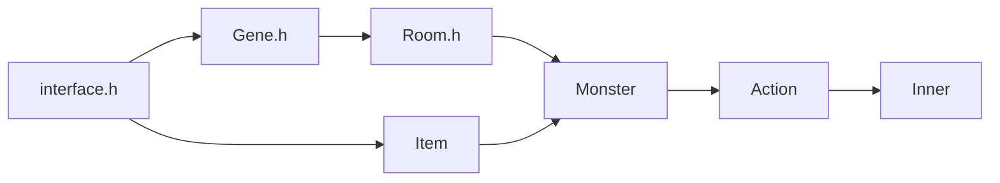
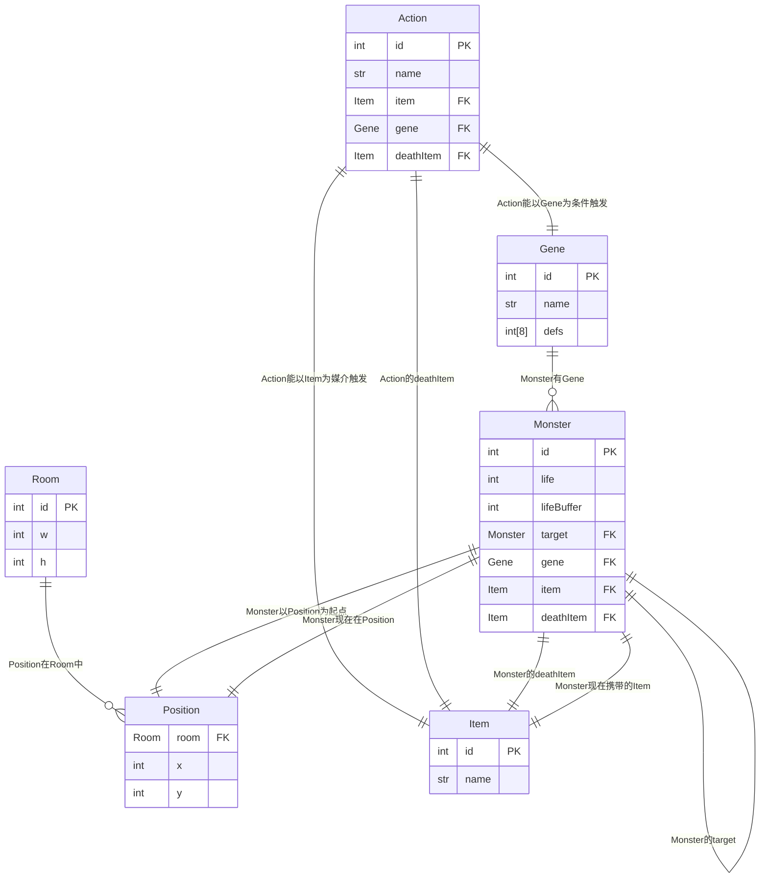

# Maze

```mermaid
flowchart LR
    interface.h --> Gene.h --> Room.h --> Monster
    interface.h --> Item --> Monster --> Action --> Inner
```

```mermaid
erDiagram 
    Room {
        int id PK
        int w
        int h
    }
    Position {
        Room room FK
        int x
        int y
    }
    Gene {
        int id PK
        str name
        int[8] defs
    }
    Monster {
        int id PK
        int life
        int lifeBuffer
        Monster target FK
        Gene gene FK
        Item item FK
        Item deathItem FK
    }
    Item {
        int id PK
        str name 
    }
    Action {
        int id PK
        str name
        Item item FK
        Gene gene FK
        Item deathItem FK
    }
    
    Room ||--o{ Position: "Position在Room中"
    Gene ||--o{ Monster: "Monster有Gene"
    Monster ||--|| Position: "Monster以Position为起点"
    Monster ||--|| Position: "Monster现在在Position"
    Action ||--|| Gene: "Action能以Gene为条件触发"
    Action ||--|| Item: "Action能以Item为媒介触发"
    Action ||--|| Item: "Action的deathItem"
    Monster ||--|| Item: "Monster的deathItem"
    Monster ||--|| Item: "Monster现在携带的Item"
    Monster ||--|| Monster: "Monster的target"
```
