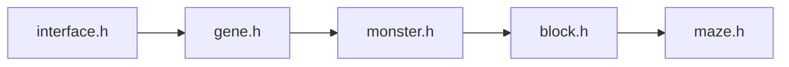
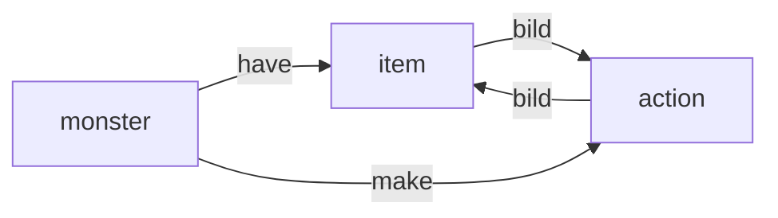

# Maze

```mermaid
flowchart LR
    interface.h --> gene.h --> monster.h  --> block.h--> maze.h
```

```mermaid
graph LR
    monster -- have --> item -- bild --> action
    monster -- make --> action -- bild --> item
  
```
