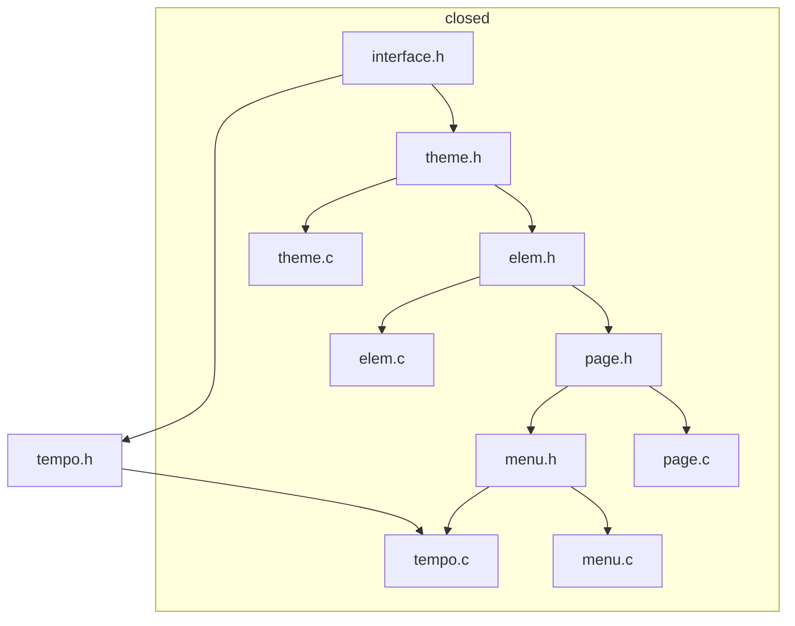

# TEMPO

```mermaid
flowchart
    subgraph closed
        interface.h --> theme.h --> elem.h --> page.h --> menu.h --> tempo.c
        theme.h --> theme.c
        elem.h --> elem.c
        page.h --> page.c
        menu.h --> menu.c
    end
    interface.h --> tempo.h --> tempo.c
```