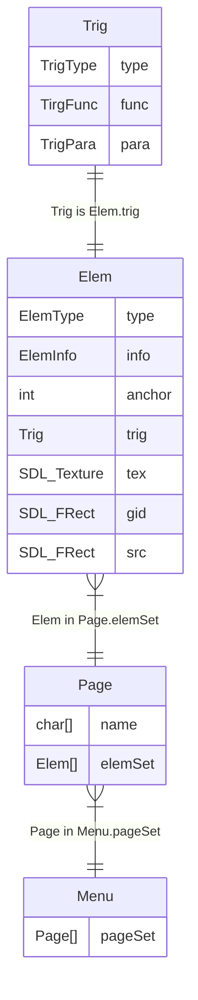
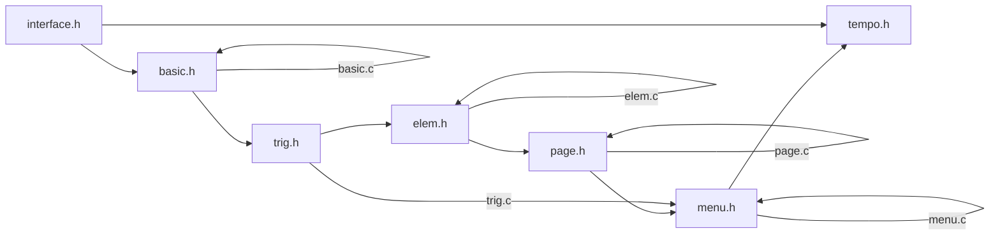

# Tempo

## 介绍

Menu为Jasmin的子模块, 承担Mouse和屏幕交互的主要功能.

| ElemType | TrigType    |
|----------|-------------|
| NULL     | NULL        |
| FILE     | MENU, OTHER |
| TEXT     | MENU, OTHER |
| SLID     | SLID        |
| KNOB     | KNOB        |

## 功能

* 静态图片/文本展示
* 可选, 频繁从toml文件重新渲染
* 按钮事件
* 界面跳转

