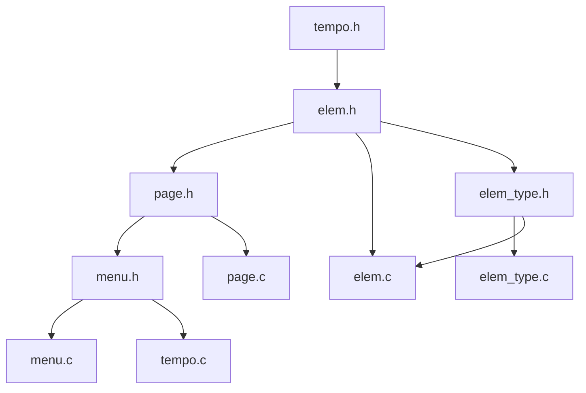

# TEMPO

```mermaid
flowchart 
    tempo.h --> elem.h --> page.h --> menu.h
    elem.h --> elem.c
    page.h --> page.c
    menu.h --> menu.c
    menu.h --> tempo.c
    elem_type.h --> elem_type.c
    elem.h --> elem_type.h --> elem.c
```
