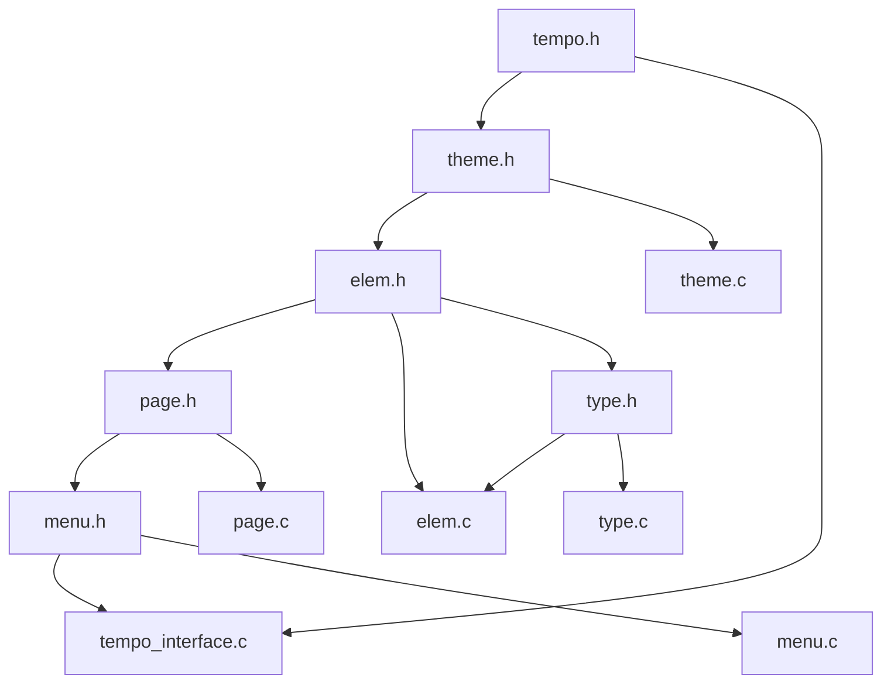

# TEMPO

```mermaid
flowchart
    tempo.h --> theme.h --> elem.h --> page.h --> menu.h --> tempo_interface.c
    theme.h --> theme.c
    elem.h --> elem.c
    page.h --> page.c
    menu.h --> menu.c
    tempo.h --> tempo_interface.c
    elem.h --> type.h --> elem.c
    type.h --> type.c
```