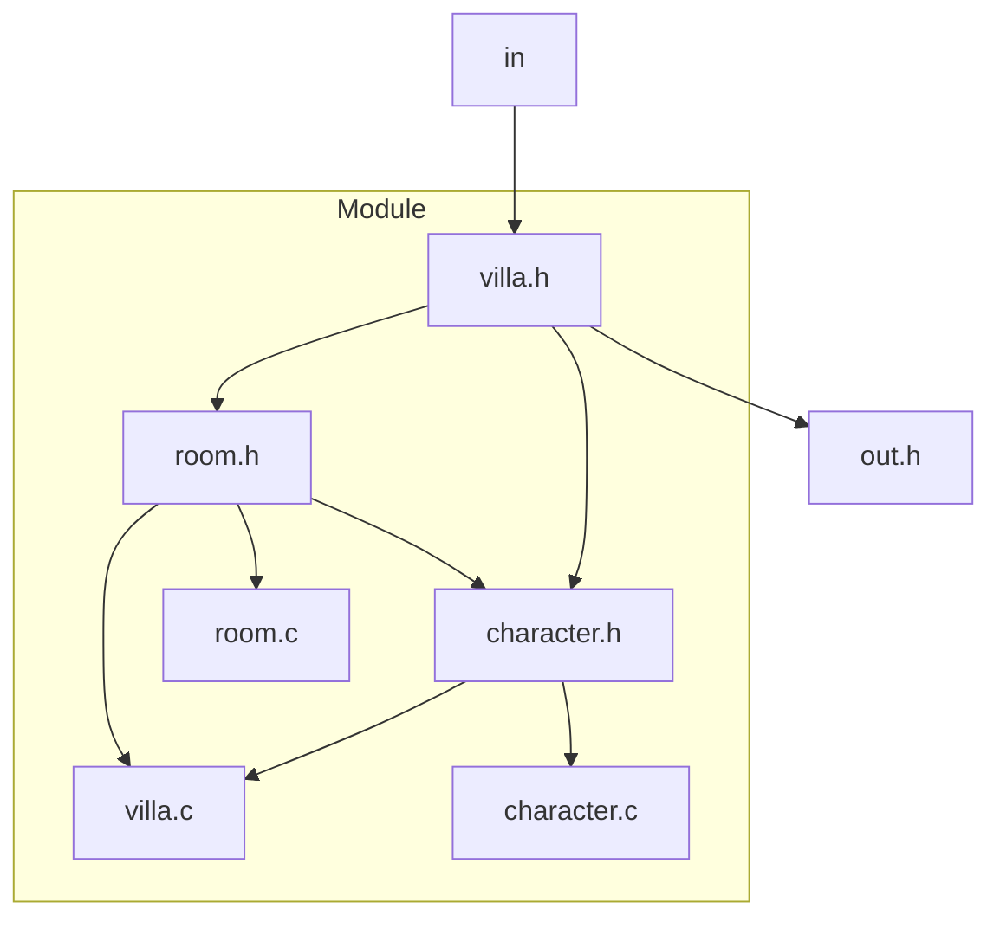

# VILLA

```mermaid
flowchart
    in --> villa.h
    subgraph Module
        villa.h --> room.h --> villa.c
        villa.h --> character.h --> villa.c
        room.h --> room.c
        character.h --> character.c
        room.h --> character.h
    end
    villa.h --> out.h
```